# Практическая работа № 1. Конечные автоматы

**Вариант 10**

## 1. Цель работы

Реализация и исследование детерминированных и недетерминированных конечных автоматов.

## 2. Постановка задачи

Построить ДКА и НКА в системе JFLAP и произвести их программную реализацию на языке Java. В коде программы должны быть сущности и процедуры, относящиеся к табличному представлению автомата. Функции обработки строковых данных использовать нельзя. Результат, выдаваемый программой на экран, должен быть внешне схож, а фактически эквивалентен результату JFLAP на тех же тестовых цепочках.

**а)** Построить ДКА, допускающий в алфавите `{0, 1}` все цепочки нулей и единиц с одинаковыми парами символов на обоих краях цепочки.

**б)** Построить НКА, допускающий язык из цепочек из 0 и 1, в которых хотя бы на одной из последних пяти позиций стоит 1.

Файлы работы:

- [Variant10_DFA.jff](Variant10_DFA.jff) - ДКА в формате JFLAP;
- [Variant10_NFA.jff](Variant10_NFA.jff) - НКА в формате JFLAP;
- [Variant10.java](Variant10.java) - программная реализация обоих автоматов.

## 3. Детерминированный конечный автомат

### 3.1. Анализ языка

Пара на левом краю - первые два символа, пара на правом краю - последние два:

`L₁ = {w ∈ {0, 1}* | |w| ≥ 2, w₁w₂ = wₙ₋₁wₙ}`, где `n = |w|`.

У цепочек длиной 0 и 1 нет пары символов на краю, поэтому они в язык не входят. При `n = 2` обе пары совпадают с самой цепочкой, поэтому любая цепочка длины 2 допускается. При `n = 3` пары перекрываются (`w₁w₂` и `w₂w₃`) и совпадают только у `000` и `111`.

Примеры: `00100`, `11011`, `01` принадлежат языку; `0`, `010`, `01010` не принадлежат.

### 3.2. Построение ДКА

Множество состояний: `Q = {q0, …, q14}`. Алфавит: `Σ = {0, 1}`. Начальное состояние - `q0`, множество допускающих состояний - `F = {q3, q6, q9, q12}`.

Автомат запоминает первую пару символов (она больше не меняется) и следит за окончанием прочитанной части. Состояния `q0`, `q1`, `q2` собирают первую пару. После второго символа автомат попадает в одну из четырёх групп по три состояния - по группе на каждую возможную первую пару - и больше из неё не выходит. Внутри группы три состояния соответствуют тому, сколько символов не хватает, чтобы окончание совпало с первой парой: 0, 1 или 2.

Таблица переходов (начальное состояние отмечено `→`, допускающие - `*`):

| Состояние | 0 | 1 | Первая пара | Окончание прочитанной части |
| --- | --- | --- | --- | --- |
| → q0 | q1 | q2 | - | ничего не прочитано |
| q1 | q3 | q6 | - | прочитан один символ `0` |
| q2 | q9 | q12 | - | прочитан один символ `1` |
| * q3 | q3 | q5 | 00 | `00` |
| q4 | q3 | q5 | 00 | `10` |
| q5 | q4 | q5 | 00 | `1` |
| * q6 | q7 | q8 | 01 | `01` |
| q7 | q7 | q6 | 01 | `0` |
| q8 | q7 | q8 | 01 | `11` |
| * q9 | q11 | q10 | 10 | `10` |
| q10 | q9 | q10 | 10 | `1` |
| q11 | q11 | q10 | 10 | `00` |
| * q12 | q14 | q12 | 11 | `11` |
| q13 | q14 | q12 | 11 | `01` |
| q14 | q14 | q13 | 11 | `0` |

**Обоснование корректности.** Первые два символа переводят автомат из `q0` через `q1` или `q2` в допускающее состояние той группы, которая соответствует первой паре. Это верно, потому что при `n = 2` цепочка всегда принадлежит языку. Дальше автомат остаётся в своей группе, то есть первая пара запоминается навсегда. Внутри группы состояние соответствует окончанию прочитанной части, записанному в таблице. Это проверяется по каждому переходу: например, в группе `00` из любого состояния по `1` окончание становится «`1`» (`q5`), из `q5` по `0` - «`10`» (`q4`), а из `q3` или `q4` по `0` - «`00`» (`q3`). Допускающее состояние каждой группы - единственное, в котором окончание совпадает с первой парой. Следовательно, автомат принимает цепочку ровно тогда, когда `w₁w₂ = wₙ₋₁wₙ`.

**Минимальность.** Состояния из разных групп различимы: они по-разному реагируют на продолжения. Внутри группы различимы допускающее состояние, состояние, из которого допускающее достигается одним символом, и состояние, из которого для этого нужно два символа. Алгоритм минимизации (Мура) не объединяет ни одной пары из 15 состояний, поэтому автомат минимален.

### 3.3. ДКА в системе JFLAP

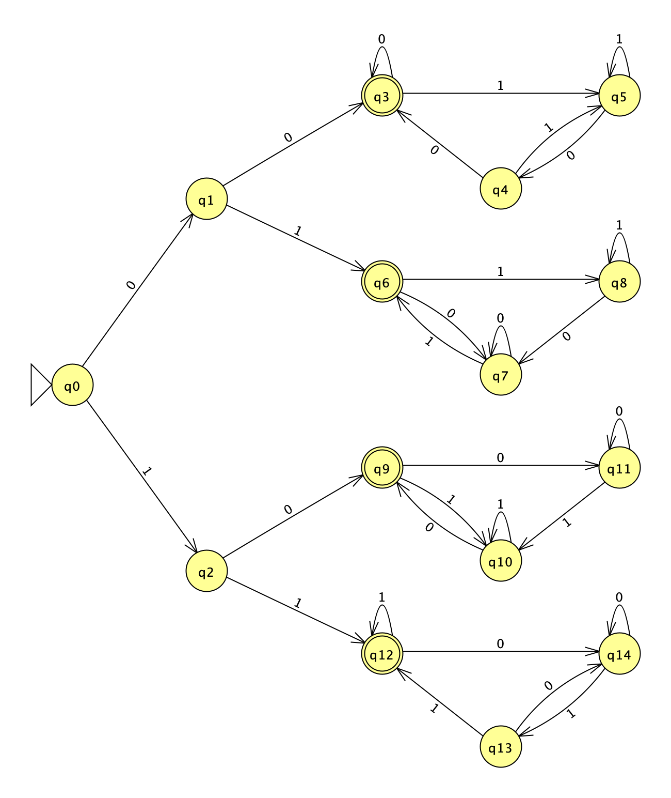

*Рисунок 1 - ДКА в JFLAP (файл [Variant10_DFA.jff](Variant10_DFA.jff))*

### 3.4. Программная реализация ДКА

ДКА задан в программе таблицей переходов `DFA[состояние][символ]` размером 15 × 2 и массивом допускающих состояний `DFA_FINAL`. Столбец 0 соответствует символу `0`, столбец 1 - символу `1`:

```java
static final int[][] DFA = {
    {1, 2},    // q0
    {3, 6},    // q1  - прочитано "0"
    {9, 12},   // q2  - прочитано "1"
    {3, 5},    // q3  - первая пара 00, окончание 00
    ...
    {14, 13},  // q14 - первая пара 11, окончание на 0
};
static final boolean[] DFA_FINAL = {
    false, false, false, true, false, false, true, false,
    false, true, false, false, true, false, false
};
```

Процедуры работы с таблицей:

- `symbolIndex(code)` - переводит код символа в номер столбца таблицы: `'0'` → 0, `'1'` → 1, другой символ → -1;
- `stepDfa(state, symbol)` - один такт: следующее состояние берётся из ячейки `DFA[state][symbol]`; символ вне алфавита даёт -1 (переход отсутствует);
- `acceptDfa(state)` - проверяет по `DFA_FINAL`, является ли состояние допускающим.

Цепочка читается посимвольно через `System.in.read()`, функции обработки строк не используются. После каждого символа программа печатает номер шага, прочитанный символ и текущее состояние, в конце - `Accept` или `Reject`.

### 3.5. Пошаговое распознавание цепочек в JFLAP

Режим **Input → Step by State**. Текущее состояние подсвечено на схеме, внизу показана конфигурация: состояние и лента, прочитанная часть которой выделена серым.

**Цепочка 00100 (принимается)**

<table>
<tr>
<td width="33%"><br><b>Шаг 0.</b> Начальная конфигурация: состояние q0, цепочка 00100 ещё не прочитана.</td>
<td width="33%"><br><b>Шаг 1.</b> Прочитан 0 → q1.</td>
<td width="33%">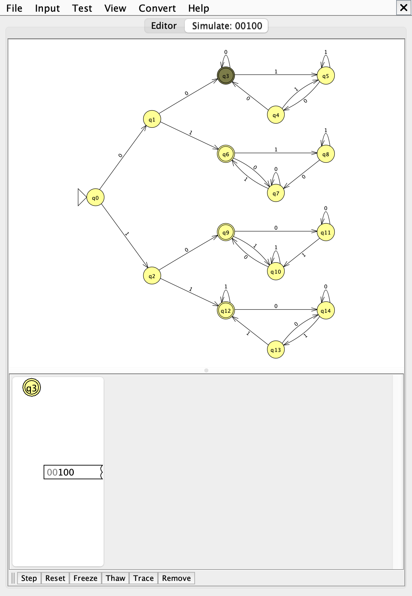<br><b>Шаг 2.</b> Прочитан 0 → q3: первая пара 00, окончание 00.</td>
</tr>
<tr>
<td width="33%">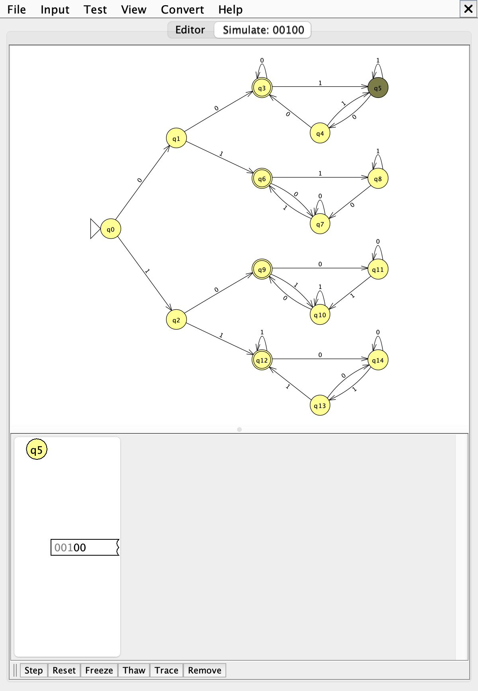<br><b>Шаг 3.</b> Прочитан 1 → q5: окончание на 1.</td>
<td width="33%">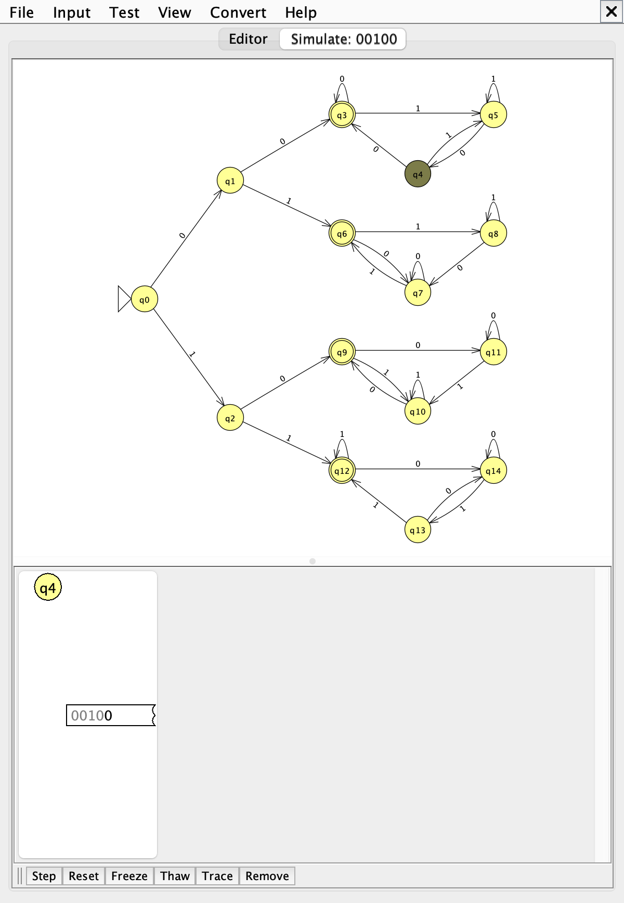<br><b>Шаг 4.</b> Прочитан 0 → q4: окончание 10.</td>
<td width="33%">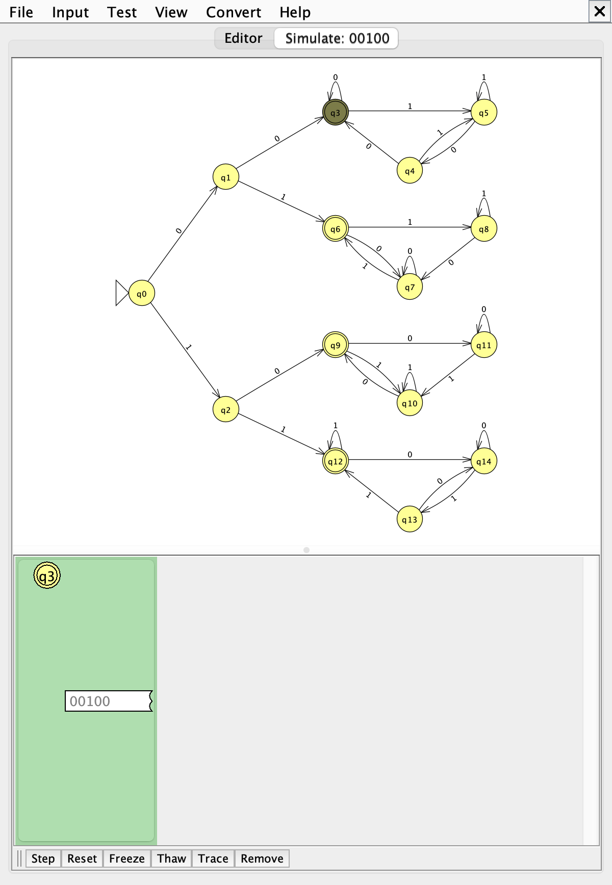<br><b>Шаг 5.</b> Прочитан 0 → q3. Цепочка прочитана, q3 допускающее, конфигурация зелёная - Accept.</td>
</tr>
</table>

*Рисунок 2 - Пошаговое распознавание цепочки 00100 ДКА в JFLAP*

**Цепочка 01010 (отклоняется)**

<table>
<tr>
<td width="33%">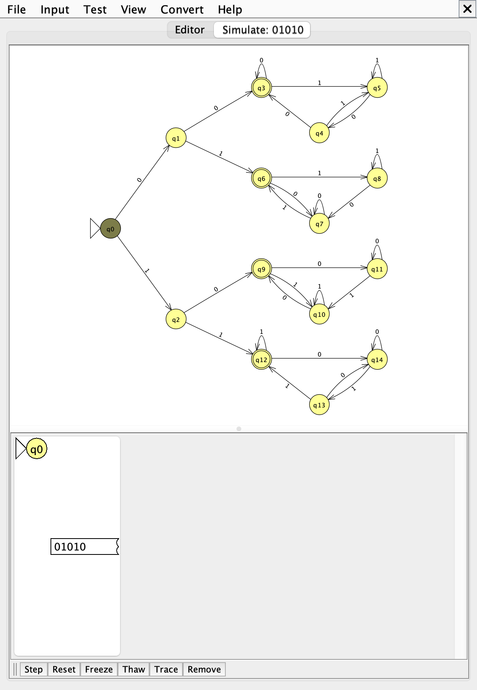<br><b>Шаг 0.</b> Начальная конфигурация: состояние q0, цепочка 01010 ещё не прочитана.</td>
<td width="33%">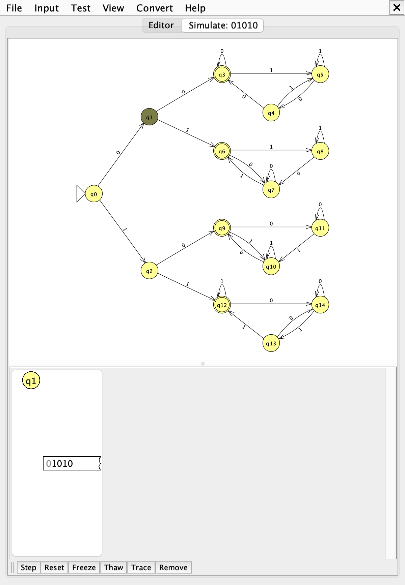<br><b>Шаг 1.</b> Прочитан 0 → q1.</td>
<td width="33%"><br><b>Шаг 2.</b> Прочитан 1 → q6: первая пара 01, окончание 01.</td>
</tr>
<tr>
<td width="33%"><br><b>Шаг 3.</b> Прочитан 0 → q7: окончание на 0.</td>
<td width="33%">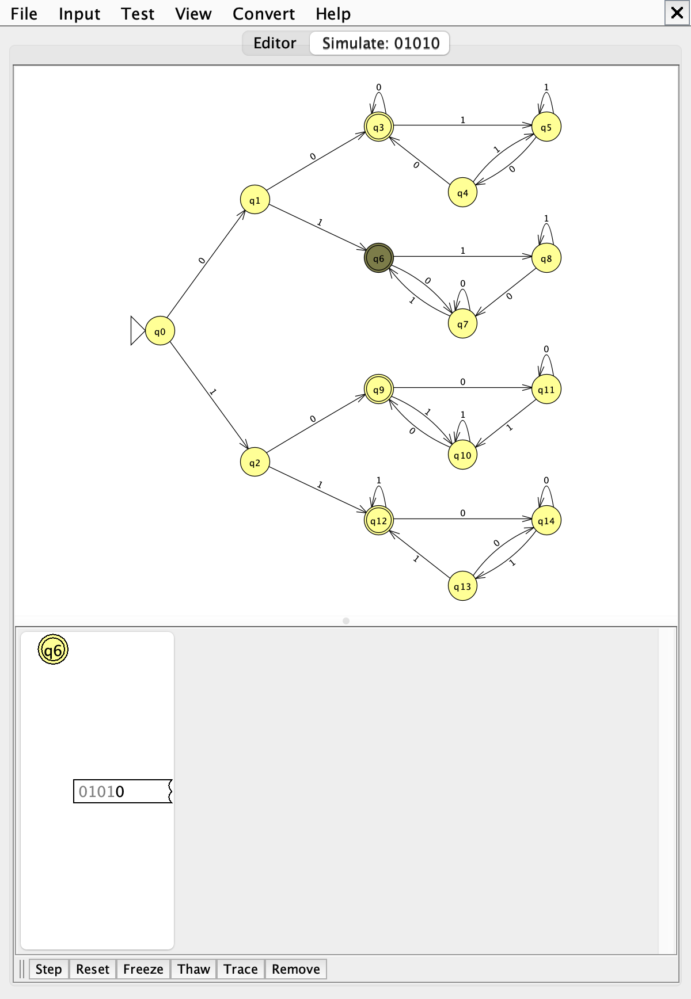<br><b>Шаг 4.</b> Прочитан 1 → q6: окончание 01.</td>
<td width="33%">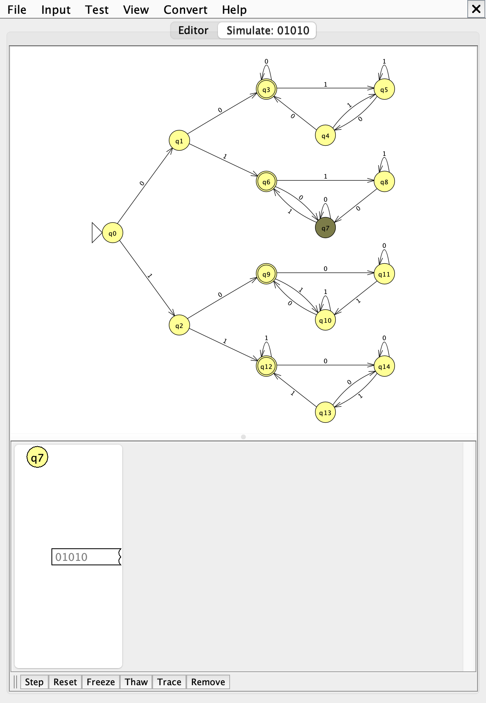<br><b>Шаг 5.</b> Прочитан 0 → q7. Цепочка прочитана, q7 не допускающее.</td>
</tr>
<tr>
<td width="33%">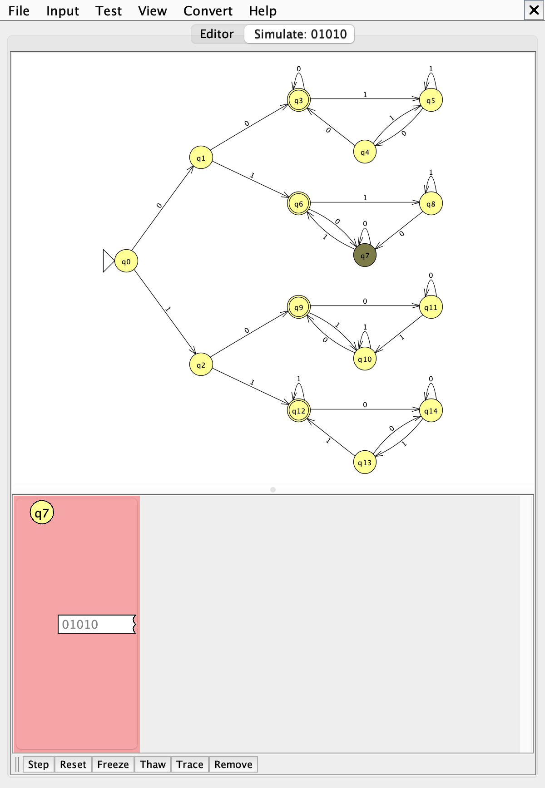<br><b>Итог.</b> Следующий Step: конфигурация окрашена красным - Reject.</td>
<td width="33%"></td>
<td width="33%"></td>
</tr>
</table>

*Рисунок 3 - Пошаговое распознавание цепочки 01010 ДКА в JFLAP*

Автомат дважды проходит через допускающее `q6`, но цепочка заканчивается в `q7`. Посещение допускающего состояния на промежуточном шаге не означает принятия всей цепочки.

### 3.6. Сравнение результатов JFLAP и программы

Вывод программы на тех же цепочках (столбец `DFA`):

```text
Variant 10 | DFA and NFA | alphabet {0, 1}
One input per line. Empty line = epsilon. EOF = exit.
Step	Read	DFA	NFA
0	-	q0	{q0}
1	0	q1	{q0}
2	0	q3	{q0}
3	1	q5	{q0, q1}
4	0	q4	{q0, q2}
5	0	q3	{q0, q3}
DFA: Accept
NFA: Accept

Step	Read	DFA	NFA
0	-	q0	{q0}
1	0	q1	{q0}
2	1	q6	{q0, q1}
3	0	q7	{q0, q2}
4	1	q6	{q0, q1, q3}
5	0	q7	{q0, q2, q4}
DFA: Reject
NFA: Accept
```

Последовательности состояний совпадают с рисунками 2 и 3: `q0 → q1 → q3 → q5 → q4 → q3` (Accept) и `q0 → q1 → q6 → q7 → q6 → q7` (Reject).

Результаты на наборе тестовых цепочек в режиме **Input → Multiple Run** (первая строка таблицы - пустая цепочка ε):

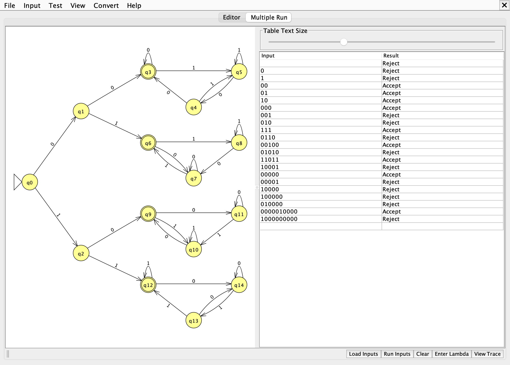

*Рисунок 4 - Multiple Run ДКА в JFLAP*

| Цепочка | JFLAP (Multiple Run) | Программа |
| --- | --- | --- |
| ε | Reject | Reject |
| 0 | Reject | Reject |
| 1 | Reject | Reject |
| 00 | Accept | Accept |
| 01 | Accept | Accept |
| 10 | Accept | Accept |
| 000 | Accept | Accept |
| 001 | Reject | Reject |
| 010 | Reject | Reject |
| 111 | Accept | Accept |
| 0110 | Reject | Reject |
| 00100 | Accept | Accept |
| 01010 | Reject | Reject |
| 11011 | Accept | Accept |
| 10001 | Reject | Reject |
| 00000 | Accept | Accept |
| 00001 | Reject | Reject |
| 10000 | Reject | Reject |
| 100000 | Reject | Reject |
| 010000 | Reject | Reject |
| 0000010000 | Accept | Accept |
| 1000000000 | Reject | Reject |

Результаты программы и JFLAP совпадают на всех тестовых цепочках.

## 4. Недетерминированный конечный автомат

### 4.1. Анализ языка

`L₂ = {w ∈ {0, 1}* | ∃ i: max(1, n − 4) ≤ i ≤ n, wᵢ = 1}`, где `n = |w|`.

Если цепочка короче пяти символов, последними пятью позициями считается вся цепочка. Пустая цепочка не содержит единиц и не допускается.

Примеры: `1`, `00001`, `10000`, `010000` принадлежат языку; `00000`, `100000` не принадлежат (в `100000` единица стоит на шестой позиции с конца).

### 4.2. Построение НКА

Множество состояний: `Q = {q0, q1, q2, q3, q4, q5}`. Алфавит: `Σ = {0, 1}`. Начальное состояние - `q0`, множество допускающих состояний - `F = {q1, q2, q3, q4, q5}`.

Таблица переходов (в ячейках - множества состояний, `∅` - перехода нет):

| Состояние | 0 | 1 |
| --- | --- | --- |
| → q0 | {q0} | {q0, q1} |
| * q1 | {q2} | {q2} |
| * q2 | {q3} | {q3} |
| * q3 | {q4} | {q4} |
| * q4 | {q5} | {q5} |
| * q5 | ∅ | ∅ |

ε-переходов нет. Недетерминизм возникает в `q0`: по символу `1` автомат может остаться в `q0` или перейти в `q1`.

**Идея.** Находясь в `q0`, автомат «угадывает», что прочитанная `1` окажется среди последних пяти позиций, и переходит в `q1`. Состояние `qk` (`k = 1…5`) означает, что после угаданной единицы прочитано ещё `k − 1` символов. Из `q5` переходов нет: после угаданной единицы может быть не больше четырёх символов.

**Обоснование корректности.** Если `wᵢ = 1` и `i ≥ n − 4`, существует путь, который читает `w₁…wᵢ₋₁` по петле в `q0`, читает `wᵢ` переходом в `q1` и оставшиеся `n − i ≤ 4` символов проходит по цепочке `q1 → … → q(n − i + 1)`. Этот путь заканчивается в допускающем состоянии. Обратно, любой допускающий путь хотя бы раз уходит из `q0` в `q1`, а это возможно только по символу `1`. Путь не может выйти за `q5`, значит после этой единицы прочитано не более четырёх символов, то есть она стоит на одной из последних пяти позиций. Следовательно, НКА распознаёт в точности `L₂`.

### 4.3. НКА в системе JFLAP

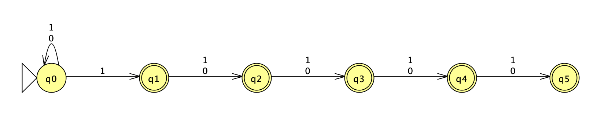

*Рисунок 5 - НКА в JFLAP (файл [Variant10_NFA.jff](Variant10_NFA.jff))*

### 4.4. Программная реализация НКА

НКА задан булевой таблицей переходов `NFA[откуда][символ][куда]` размером 6 × 2 × 6: значение `true` означает, что переход есть. Так в одной ячейке «состояние × символ» хранится множество следующих состояний. Допускающие состояния - массив `NFA_FINAL`:

```java
static final boolean[][][] NFA = new boolean[NFA_STATES][2][NFA_STATES];
static final boolean[] NFA_FINAL = {false, true, true, true, true, true};
static {
    NFA[0][0][0] = true;
    NFA[0][1][0] = true;
    NFA[0][1][1] = true;
    for (int from = 1; from < 5; from++) {
        NFA[from][0][from + 1] = true;
        NFA[from][1][from + 1] = true;
    }
}
```

Процедуры работы с таблицей:

- `nfaStart()` - начальное множество активных состояний `{q0}`;
- `stepNfa(current, symbol)` - один такт: новое множество активных состояний - объединение по таблице переходов из всех текущих состояний;
- `acceptNfa(states)` - цепочка допускается, если среди активных состояний есть допускающее.

Программа печатает множество активных состояний после каждого символа - это те же конфигурации, которые JFLAP показывает в режиме пошагового выполнения.

### 4.5. Пошаговое распознавание цепочек в JFLAP

Каждой активной ветви НКА в JFLAP соответствует отдельная конфигурация внизу окна.

**Цепочка 0010000 (принимается)**

<table>
<tr>
<td width="50%"><br><b>Шаг 0.</b> Начальная конфигурация: {q0}, цепочка 0010000 ещё не прочитана.</td>
<td width="50%">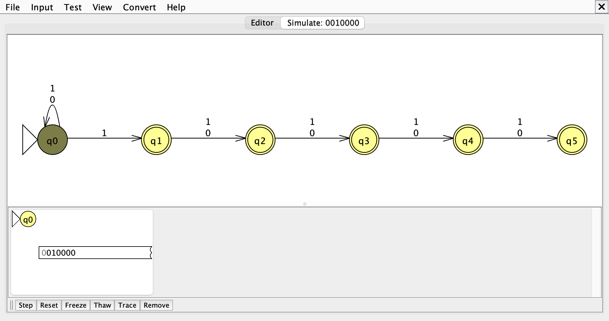<br><b>Шаг 1.</b> Прочитан 0: {q0}.</td>
</tr>
<tr>
<td width="50%"><br><b>Шаг 2.</b> Прочитан 0: {q0}.</td>
<td width="50%">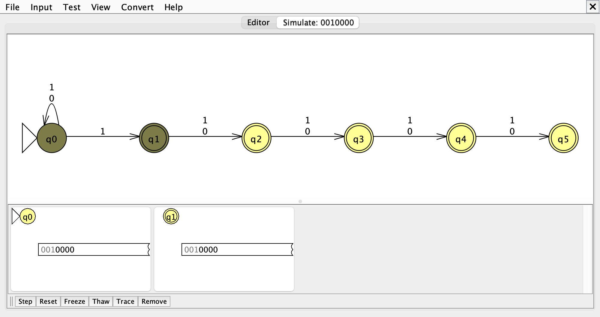<br><b>Шаг 3.</b> Прочитан 1: ветвление, {q0, q1}.</td>
</tr>
<tr>
<td width="50%"><br><b>Шаг 4.</b> Прочитан 0: {q0, q2}.</td>
<td width="50%">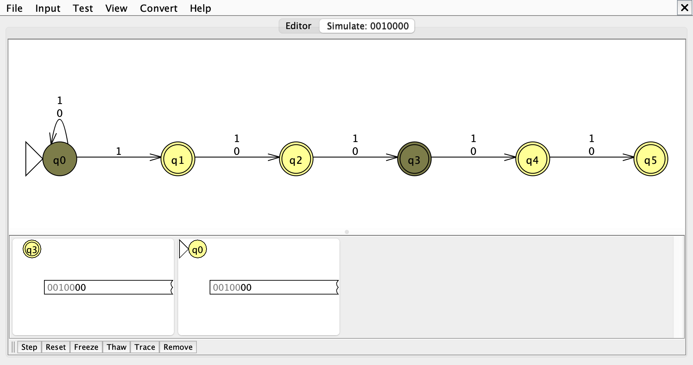<br><b>Шаг 5.</b> Прочитан 0: {q0, q3}.</td>
</tr>
<tr>
<td width="50%"><br><b>Шаг 6.</b> Прочитан 0: {q0, q4}.</td>
<td width="50%">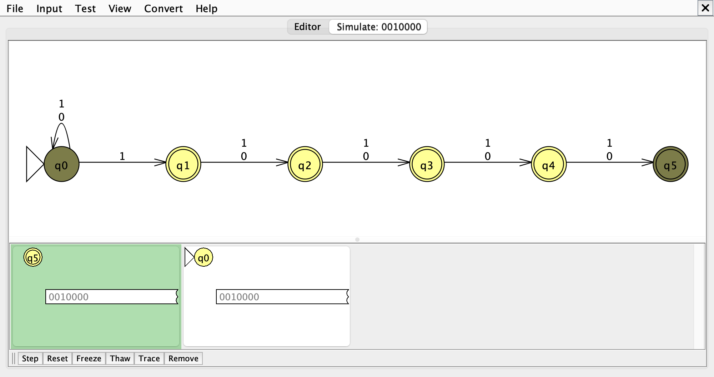<br><b>Шаг 7.</b> Прочитан 0: {q0, q5}. Цепочка прочитана, ветвь в допускающем q5 зелёная - Accept.</td>
</tr>
</table>

*Рисунок 6 - Пошаговое распознавание цепочки 0010000 НКА в JFLAP*

**Цепочка 1000000 (отклоняется)**

<table>
<tr>
<td width="50%"><br><b>Шаг 0.</b> Начальная конфигурация: {q0}, цепочка 1000000 ещё не прочитана.</td>
<td width="50%"><br><b>Шаг 1.</b> Прочитан 1: ветвление, {q0, q1}.</td>
</tr>
<tr>
<td width="50%">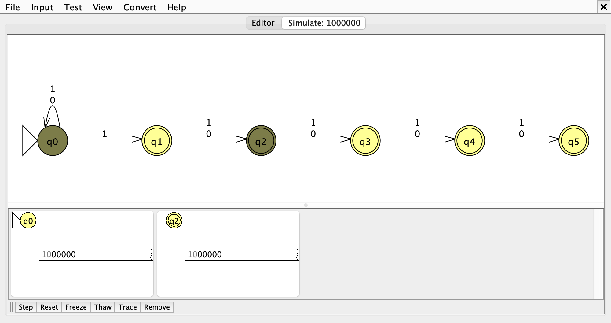<br><b>Шаг 2.</b> Прочитан 0: {q0, q2}.</td>
<td width="50%">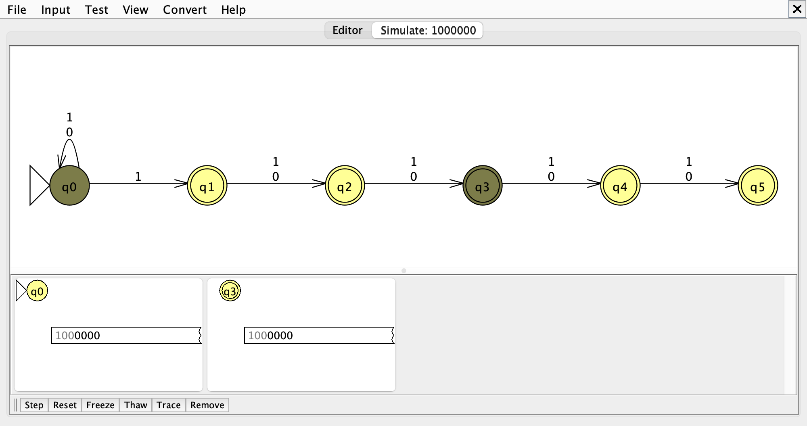<br><b>Шаг 3.</b> Прочитан 0: {q0, q3}.</td>
</tr>
<tr>
<td width="50%">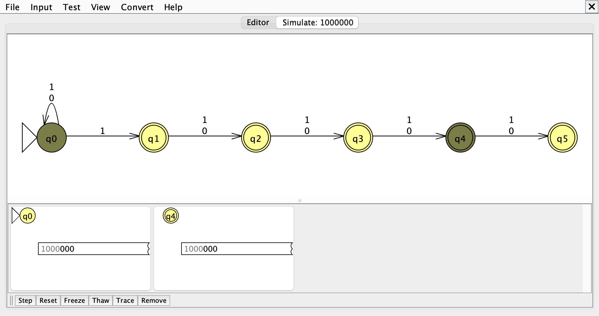<br><b>Шаг 4.</b> Прочитан 0: {q0, q4}.</td>
<td width="50%">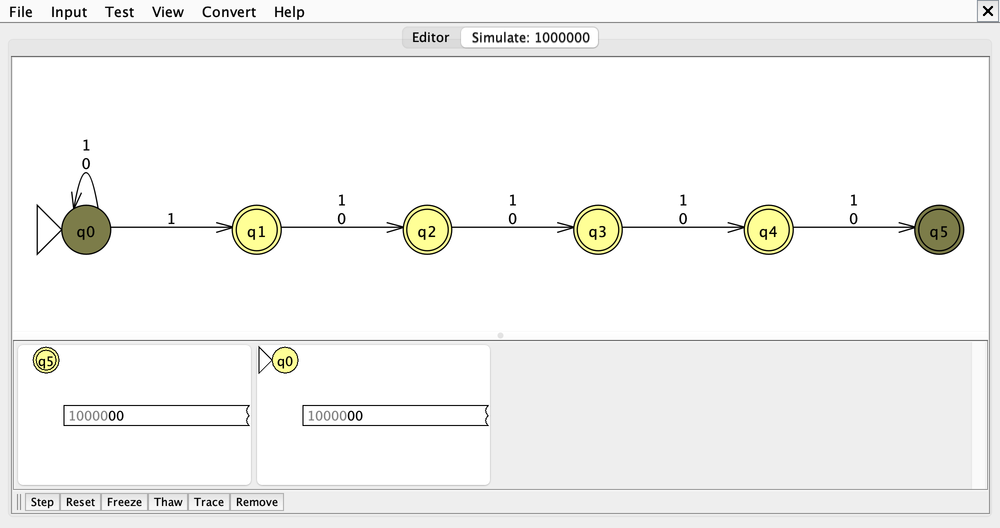<br><b>Шаг 5.</b> Прочитан 0: {q0, q5}.</td>
</tr>
<tr>
<td width="50%">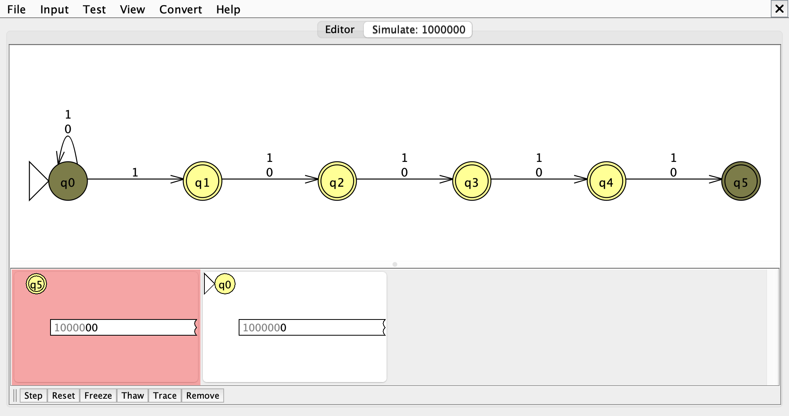<br><b>Шаг 6.</b> Шестой символ: из q5 перехода нет, эта ветвь отклонена (красная). Продолжает только q0.</td>
<td width="50%">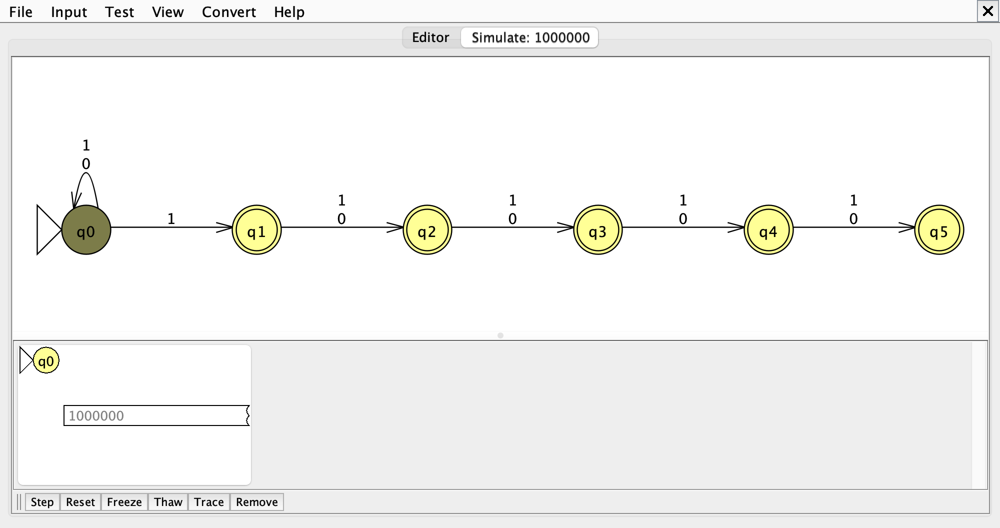<br><b>Шаг 7.</b> Прочитан 0: {q0}. Цепочка прочитана, q0 не допускающее.</td>
</tr>
<tr>
<td width="50%">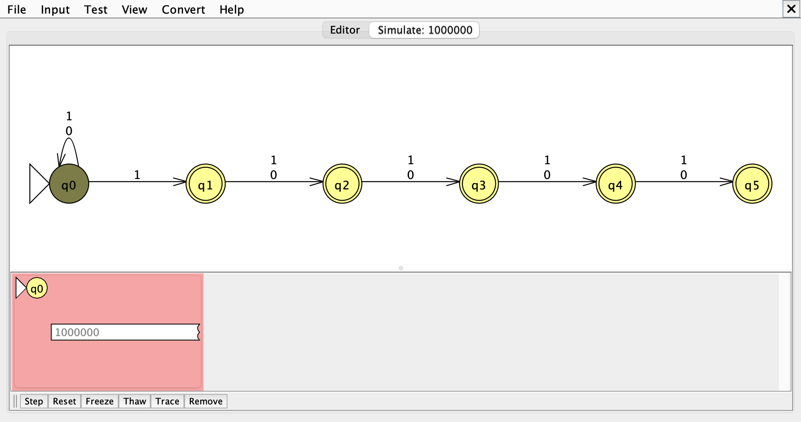<br><b>Итог.</b> Следующий Step: конфигурация окрашена красным - Reject.</td>
<td width="50%"></td>
</tr>
</table>

*Рисунок 7 - Пошаговое распознавание цепочки 1000000 НКА в JFLAP*

### 4.6. Сравнение результатов JFLAP и программы

Вывод программы на тех же цепочках (столбец `NFA`):

```text
Variant 10 | DFA and NFA | alphabet {0, 1}
One input per line. Empty line = epsilon. EOF = exit.
Step	Read	DFA	NFA
0	-	q0	{q0}
1	0	q1	{q0}
2	0	q3	{q0}
3	1	q5	{q0, q1}
4	0	q4	{q0, q2}
5	0	q3	{q0, q3}
6	0	q3	{q0, q4}
7	0	q3	{q0, q5}
DFA: Accept
NFA: Accept

Step	Read	DFA	NFA
0	-	q0	{q0}
1	1	q2	{q0, q1}
2	0	q9	{q0, q2}
3	0	q11	{q0, q3}
4	0	q11	{q0, q4}
5	0	q11	{q0, q5}
6	0	q11	{q0}
7	0	q11	{q0}
DFA: Reject
NFA: Reject
```

Множества активных состояний совпадают с конфигурациями на рисунках 6 и 7. На шаге 6 цепочки `1000000` JFLAP показывает оборвавшуюся ветвь `q5` красным и затем убирает её; в выводе программы её уже нет в множестве.

Результаты на наборе тестовых цепочек в режиме **Input → Multiple Run**:

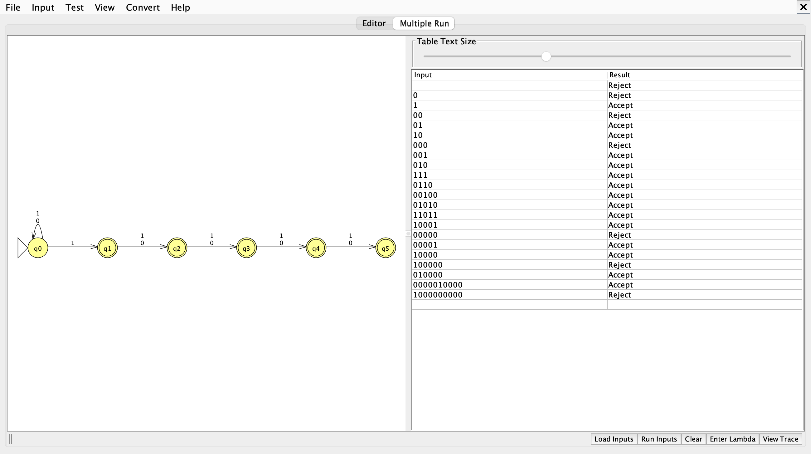

*Рисунок 8 - Multiple Run НКА в JFLAP*

| Цепочка | JFLAP (Multiple Run) | Программа |
| --- | --- | --- |
| ε | Reject | Reject |
| 0 | Reject | Reject |
| 1 | Accept | Accept |
| 00 | Reject | Reject |
| 01 | Accept | Accept |
| 10 | Accept | Accept |
| 000 | Reject | Reject |
| 001 | Accept | Accept |
| 010 | Accept | Accept |
| 111 | Accept | Accept |
| 0110 | Accept | Accept |
| 00100 | Accept | Accept |
| 01010 | Accept | Accept |
| 11011 | Accept | Accept |
| 10001 | Accept | Accept |
| 00000 | Reject | Reject |
| 00001 | Accept | Accept |
| 10000 | Accept | Accept |
| 100000 | Reject | Reject |
| 010000 | Accept | Accept |
| 0000010000 | Accept | Accept |
| 1000000000 | Reject | Reject |

Результаты программы и JFLAP совпадают на всех тестовых цепочках. Дополнительно для всех 8191 цепочек над `{0, 1}` длиной от 0 до 12 результаты программы совпали с результатами симулятора JFLAP 7.1 на файлах `Variant10_DFA.jff` и `Variant10_NFA.jff`.

## 5. Возможность построения конечных автоматов

Для обеих частей варианта 10 конечные автоматы построены: ДКА содержит 15 состояний (минимальный), НКА - 6. Их корректность обоснована в разделах 3.2 и 4.2. Доказательство невозможности построения для этих языков не требуется.

## 6. Вывод

В работе построены ДКА и НКА для языков варианта 10 в системе JFLAP и выполнена их программная реализация на Java с табличным представлением автоматов. Пошаговое выполнение в JFLAP и вывод программы на одних и тех же цепочках дают одинаковые последовательности состояний и одинаковые результаты `Accept`/`Reject`.

## Запуск программы

```bash
javac Variant10.java
java Variant10
```

Каждая строка ввода - отдельная цепочка, пустая строка - ε, конец ввода (`Ctrl+D`) - выход. Для каждой цепочки программа печатает шаги (`Step`, `Read`, состояние ДКА, множество состояний НКА) и итог `Accept`/`Reject` для каждого автомата. Символ вне алфавита `{0, 1}` приводит к отклонению цепочки обоими автоматами, как и в JFLAP.

Чтобы повторить проверку в JFLAP, откройте нужный JFF-файл через **File → Open** и выберите **Input → Step by State** (пошагово) или **Input → Multiple Run** (набор цепочек).
